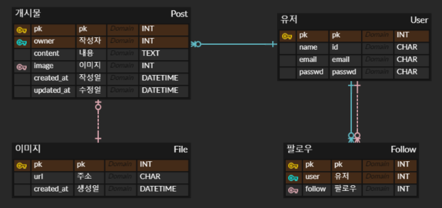

# 첫 번째 트렉 프로젝트

- [첫 번째 트렉 프로젝트](#첫-번째-트렉-프로젝트)
- [plan](#plan)
  - [github](#github)
  - [CI/CD](#cicd)
  - [INFRA](#infra)
  - [BACKEND](#backend)
- [TODO](#todo)
  - [DRF](#drf)
  - [docker](#docker)
  - [terraform](#terraform)
  - [github actions](#github-actions)
- [Quick Start](#quick-start)
  - [Local](#local)
  - [Prod](#prod)

# plan

## github

- 피어리뷰를 위해 main 브랜치는 제출 전 PR
- main 대신 develop 브랜치에 변경사항 적용
- main, develop 브랜치 pull 비활성화 (적용 불가능)
- 모든 기능은 issue로 생성하고 PR로 마무리
- github projects와 issues를 활용하여 프로젝트 관리

## CI/CD

- CI/CD는 github actions 사용
- NCP CR, docker로 배포
- main, develop 브랜치를 prod로 나머지를 staged로 배포
- 배포 인스턴스에 ssh로 접속하여 배포
- allowed hosts만 환경변수로 입력

## INFRA

- terraform으로 staged, prod 환경 따로 구성
- terraform state는 s3 backend와 NCP Object Storage 사용
- 생성된 인스턴스 ip, LB url등은 github actions secret에 업데이트 -> token으로 접근이 안돼 불가능
- actions에서 새로운 이미지로 업데이트 가능하도록 구성

## BACKEND

- 테스트는 docker compose 활용
- 환경변수로 allowed hosts, secret key, db, env 정보 입력
- gunicorn 사용
- ERD
  
- API  
  ```yaml
  User:
    - path: /tweet/user
      method: GET
      description: 전체 유저 조회
      response: 유저 리스트
    
    - path: /tweet/user/posts
      method: GET
      description: 유저가 작성한 전체 개시글 조회
      response: 개시글 리스트

  Post:
    - path: /tweet/post
      method: GET
      description: 전체 개시글 조회
      response: 개시글 리스트

    - path: /tweet/post
      method: POST
      description: 개시글 작성
      response: 생성된 개시글 정보

    - path: /tweet/post/<int:post_id>
      method: PUT
      description: 개시글 수정
      response: 수정된 개시글 정보
    
    - path: /tweet/post/<int:post_id>
      method: DELETE
      description: 개시글 삭제
      response: 삭제된 개시글 정보

  Follow:
    - path: /tweet/follow
      method: GET
      description: 팔로우한 유저 조회
      response: 유저 리스트
    
    - path: /tweet/follow
      method: POST
      description: 팔로우 생성
      response: 204
    
    - path: /tweet/follow/<int:user_id>
      method: DELETE
      description: 언팔로우
      response: 204

    - path: /tweet/follow/follower
      method: GET
      description: 나를 팔로우한 유저 조회
      response: 유저 리스트

  ```
# TODO

대략적인 계획입니다.  
자세한 내용은 issue를 참고해주세요.

## DRF

- [x] 프로젝트 생성
- [x] 앱 생성
- [x] 환경 분리
- [x] 설정 변경
- [x] start script 작성
- [x] entrypoint script 작성
- [x] ERD 구성
- [x] 모델 작성
- [x] 테스트 작성
- [x] VIEWSET 생성
- [x] boto3 NCP 연결
- [x] docs 페이지 생성

## docker

- [x] dockerfile 작성
- [x] docker compose 구성

## terraform

- [x] server 생성 전 LB url 생성 테스트
- [x] network 모듈 생성
- [x] server 모듈 생성
- [x] LB 모듈 생성
- [ ] github secret 모듈 생성 (실패)
- [x] prod 환경 생성

## github actions

- [x] docker build
- [x] DRF test
- [x] docker push
- [x] server update
- [x] 실패시 discord 알림

# Quick Start

## Local

.env 파일을 생성하고 다음 내용을 작성해 줍니다.
```env
# DB
POSTGRES_DB=postgres
POSTGRES_USER=postgres
POSTGRES_PASSWORD=postgres
POSTGRES_PORT=5432

# DRF
DB_HOST=db
DJANGO_SECRET_KEY=enter_your_django_secret
RUN_MODE=local
DJANGO_ALLOWED_HOST=localhost

# NCP
NCP_ACCESS_KEY=enter_your_ncp_access_key
NCP_SECRET_KEY=enter_your_ncp_secret_key
```

compose를 싱행해주고 테스트를 실행합니다.

```bash
docker compose up -d --build
# for test
docker compose exec follow-app python manage.py test
```

추가로 더미데이터를 생성할 수 있습니다.

```bash
docker compose exec -it follow-app python manage.py make_dummy
```

더미 유저는 id, pw 모두 user0~user4로 생성됩니다.

테스트는 /api/docs/ 또는 VScode의 Thunder Client를 사용해 테스트할 수 있습니다.

## Prod

infra/prod 디렉토리에 terraform.tfvars 파일을 생성하고 다음 내용을 작성해 줍니다.

생성된 인스턴스의 기본 유저는 terry 입니다.

```bash
NCP_ACCESS_KEY    = "enter_your_ncp_access_key"
NCP_SECRET_KEY    = "enter_your_ncp_secret_key"
password          = "enter_your_server_password"
postgres_db       = "enter_your_db_name"
postgres_user     = "enter_your_db_user"
postgres_password = "enter_your_db_password"
ncr_registry      = "enter_your_ncr_registry_url"
django_secret_key = "enter_your_django_secret"
```

statefile 관리를 위해 infra/prod/ 디렉토리에 .credentials 파일도 생성하고 다음 내용을 작성해 줍니다.

```ini
[default]
aws_access_key_id = enter_your_ncp_access_key
aws_secret_access_key = enter_your_ncp_secret_key
```

terraform init후 인프라를 생성해 줍니다.

```bash
terraform init
terraform apply --auto-approve
```

출력으로 be 인스턴스 ip와 LB url을 얻을 수 있습니다.

```bash
be_public_ip = "223.130.163.73"
domian = "prod-lb-19480009-8e40422f6c1b.kr.lb.naverncp.com"
```

PS
테라폼이로 prod 환경을 구성할 때 LB주소를 변수로 넘겨줘서 ALLOWED_HOSTS에 추가하는 것은 의외로 잘 되었는데 NCP 크래딧이 조금 아슬아슬 하여 서버를 열어두진 않았습니다.